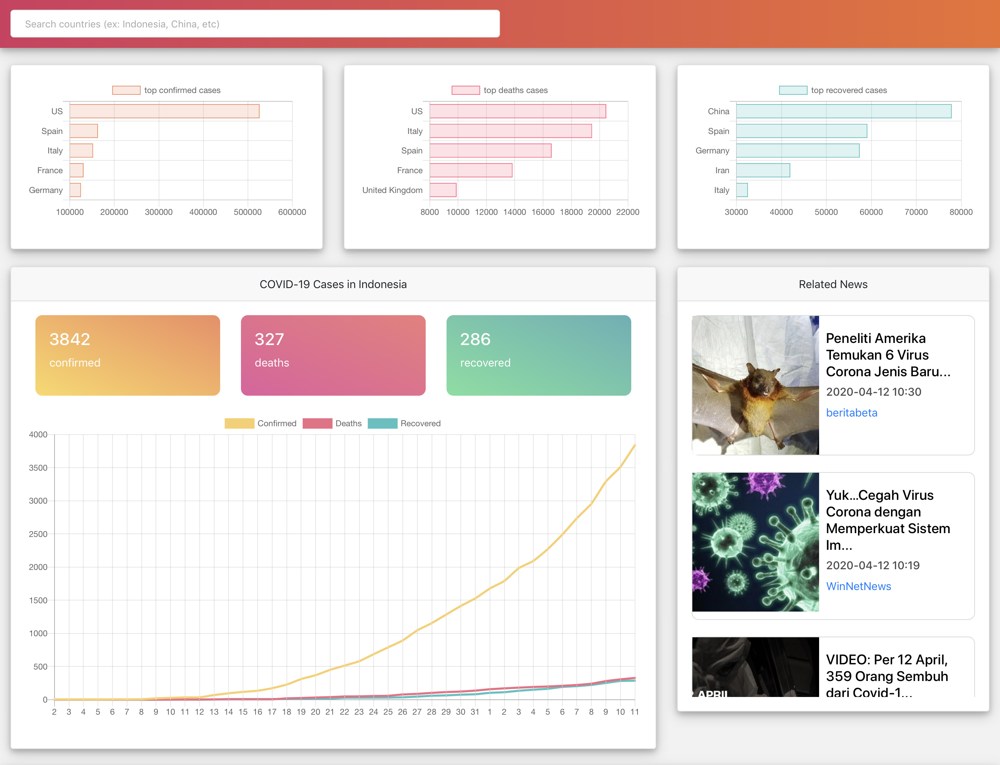

# COVID-19 Dashboard

This is a simple COVID-19 dashboard made with React.js that lets you see what is going on in your selected country regarding the COVID-19 pandemic. You can see confirmed cases, number of people recovered and died during this pandemic in specific countries. You can also see related news on a specific country.

## Preview



This is a preview of how the dashboard looks like. It shows top 5 cases based on each categories (confirmed, deaths and recovered), a graph and news that show the update on your designated country.

## Installation

Assuming you already have [Node.js](https://nodejs.org/en/download/) installed in your device, to install the project, you can clone this repository to your device, then follow these steps:
- Go to the project directory
    ```
    cd covid19-dashboard
    ```
- Install the dependencies
    ```
    npm install
    ```
- Run the app
    ```
    npm start
    ```

Open [http://localhost:3000](http://localhost:3000) to view it in the browser.

## Resources

For this project, I use NewsAPI to gather news on every countries and Pomber's COVID-19 API to get a timeseries data of every countries.

- Pomber's COVID-19 API - [https://github.com/pomber/covid19](https://github.com/pomber/covid19)
- NewsAPI - [https://newsapi.org/](https://newsapi.org/)
